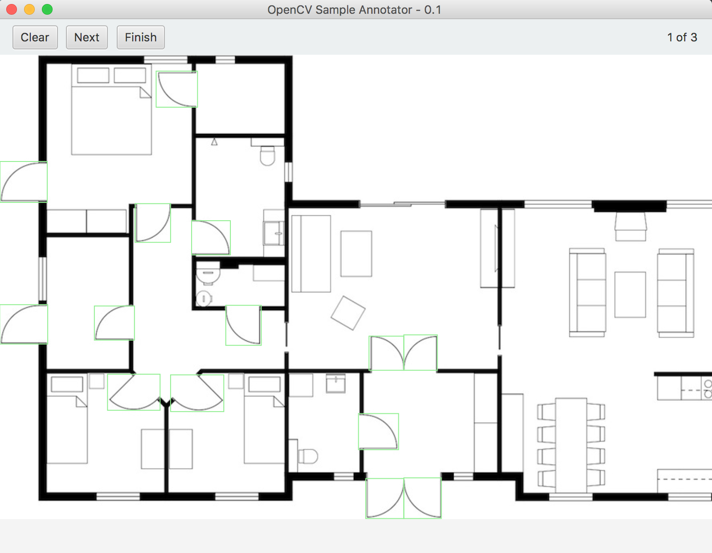

# OpenCV Sample Annotator
A simple tool to create positive and negative samples for [cascading classifiers](http://docs.opencv.org/trunk/dc/d88/tutorial_traincascade.html).

**Next steps**

* implement rectangle selection and deletion

## Download
Download the source code or use a prebuilt binary:

* MacOSX - [OpenCVSampleAnnotator.app](https://github.com/cansik/opencv-sample-annotator/releases/download/0.1/OpenCVSampleAnnotator.zip)
* Jar - [opencv-sample-annotator.jar](https://github.com/cansik/opencv-sample-annotator/releases/download/0.1/opencv-sample-annotator.jar)

## Tool
When you first start the application you have to choose the dataset (images to annotate) and also the output file.

Then every image is showed to you and you have to annotate all elements you want to classify in the image. With the `Clear` button it is possible to clear all rectangles on the image.



After the last image is processed or you clicked `Finish` the application creates the output as a text file which can be read by the `opencv_createsamples` application.

Here you see an example of the `positives.txt`:

```
10-House-Floor-Plans-962270.jpg 4 -1 130 71 59 187 12 68 55 160 177 57 61 237 198 49 55 
arapahoFloorPlanLg.JPG 2 301 305 56 50 384 345 45 51 
floorplan1_fs.jpg 3 217 160 26 24 243 137 24 21 192 122 27 31 
```

## About
Developed during the [bachelor thesis](https://github.com/cansik/architectural-floor-plan) of Alexander Wyss & Florian Bruggisser.